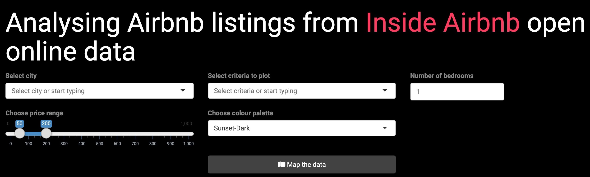

---
title: "<br/> <br/> Matt Malishev"
author: "<div style=\"color:#FF385C;\"> <center> Dissecting Airbnb's open data with map data analytics </center> </div>"
date: "<center> <a style=\"color:#FF385C;\" href='https://twitter.com/darwinanddavis'> @darwinanddavis </a></center>"
params:
    width: "auto" 
    height: "auto"
# autosize: true
header-includes: \usepackage{float}
always_allow_html: yes
output:
  revealjs::revealjs_presentation:
    css: style/styles.css
    theme: simple #default moon night black sky
    highlight: pygments
    incremental: true
    center: false
    transition: slide
    background-transition: slide
    mathjax: local # null
    self_contained: false
    slide_level: 1
    # reveal_plugins: ["notes", "search", "zoom", "chalkboard"] # ALT + mouseclick to zoom
    reveal_options:
      slideNumber: true
      fig_caption: true
      # fig_width: 10
      # fig_height: 10
      # showNotes: true
      previewLinks: true
      minScale: 1.0
      maxScale: 1.0
---  

```{r, set-options, echo = FALSE, cache = FALSE}
knitr::opts_chunk$set(
 eval = T, # run all code
 echo = F, # show code chunks in output 
 tidy = T, # make output as tidy
 message = F,  # mask all messages
 warning = F, # mask all warnings 
 out.width="100%",
 size="small", # set code chunk size, 
 knitr::opts_chunk$set(fig.pos = 'H')
)
# options(width = 2000)
# get device output size
# dev.size("px")
```

<!-- install packages -->
```{r, load packages, include=T, cache=F, message=F, warning=F, results='hide',echo=F}
packages <- c("ggplot2","dplyr","tidyverse","RColorBrewer","plyr","leaflet","widgetframe","here")  
if (require(packages)) {
    install.packages(packages,dependencies = T)
    require(packages)
}
suppressPackageStartupMessages(
  lapply(packages,library,character.only=T) 
)

# update packages 
# update.packages(ask = FALSE, checkBuilt = TRUE)

require(RCurl)
require(RColorBrewer)
require(dplyr)
require(plotly)
require(leaflet)

```


```{css}
.reveal section img { 
  background:none; 
  border:none; 
  box-shadow:none; 
}

.reveal section h3 {
  color:#FF385C;
}
```


<!-- ________________________________________________________ slide break -->

### Analysing Airbnb open data  

Airbnb's open database [Inside Airbnb](http://insideairbnb.com/) provides access to data for Airbnb listings for major cities around the world.  
  
```{r,echo=T}
url <- "http://data.insideairbnb.com/australia/vic/melbourne/2020-03-16/data/listings.csv.gz" 
```

Property listings for each city are stored as dataframes containing a wealth of useful and interesting variables.  

```{r,echo=F,eval=F}
pacman::p_load(readr,dplyr,stringr)
df <- url %>% read_csv
df <- df[1:500,]  
write_csv(df,"docs/df.csv") 
```


```{r,eval=T,echo=F,warning=F,message=F}
pacman::p_load(readr,dplyr,stringr)
df <- read_csv("docs/df.csv") 
colnames(df) <- df %>% names %>% str_to_title() %>% str_replace_all("_", " ")
df %>% names %>% unlist
```

<!-- ________________________________________________________ slide break -->

### The app: Analysing Airbnb listings from Inside Airbnb open online data  

The `Shiny` app scrapes Airbnb listing data from [Inside Airbnb](http://insideairbnb.com/) and maps the data based on criteria the user selects.   

First, the user selects the city they want to visualise. The data are pulled from the web and the dataframe is filtered by the available criteria to plot and stored in `R`.        

```{r,eval=T,echo=T}
df %>% select(`Host name`,`Host url`,Longitude, Latitude,Bedrooms,Neighbourhood,Price,`Review scores rating`,`Review scores location`,`Review scores cleanliness`,`Review scores communication`,`Review scores accuracy`,`Bed type`,`Room type`,`Property type`,`Cancellation policy`,`Reviews per month`,`Review scores rating`,`Security deposit`,`Cleaning fee`,`Accommodates`) %>% as.data.frame()
```
  
---    

### Selecting the data    

The user selects the base criteria of **Price** and **Number of bedrooms** in addition to the **Criteria** they want to visualise, such as _Cancellation policy_. The data are then analysed and subsetted by these filters. The user then selects the **Colour palette** for visualising the data.          



---  

### Mapping the data  

The filtered data are then passed to `leaflet` to plot as an interactive map using **Map the data**. Users can alter the criteria and reload the current map or choose another city to plot to compare criteria among cities.  

```{r,echo=F}
# clean data 
df <- df[1:500,]
df <- df %>% mutate(`Price` = `Price` %>% str_sub(2) %>% str_trim("both") %>% as.numeric,
                                `Cleaning fee` = `Cleaning fee` %>% str_sub(2) %>% str_trim("both") %>% as.numeric,
                                `Security deposit` = `Security deposit` %>% str_sub(2) %>% str_trim("both") %>% as.numeric,
                                `Cancellation policy` = `Cancellation policy` %>% str_to_title() %>% str_replace_all("_", " "))
```

```{r, echo=T}
require(colorspace); require(RColorBrewer)
input_price <- c(50,200) # user price
input_bedroom <- 2 # user bedrooms
input_criteria <- "Cancellation policy" # user criteria
input_col <- "Sunset-Dark" # user col palette
criteria <- df %>%
  filter(Price >= input_price[1] & Price <= input_price[2],
         Bedrooms == input_bedroom) %>%
  pull(input_criteria)
col <- criteria %>% # pull user criteria 
      as.factor %>% as.integer() %>% # turn into num for col pal
      na.omit() # rm nas
colv <- colorRampPalette(sequential_hcl(col %>% length, input_col))
colv_vec <- colv(col %>% length)[as.numeric(cut(col, breaks = length(col)))]  # define breaks in col gradient
colv_vec[is.na(colv_vec)] <- "black" # change NA to black

```

---  

### Thanks for playing    

Check out the [Shiny app here](https://darwinanddavis.shinyapps.io/airbnb/).  
Code for `ui.R` and `server.R` found on [Github](https://github.com/darwinanddavis/data_science_specialisation/tree/gh-pages/data_products/week4/airbnb/).   

```{r, echo=T}
leaflet() %>% addTiles() %>% addProviderTiles("CartoDB") %>%
  addCircles(data = df %>% select(Longitude,Latitude),
                     color = colv_vec, # user col palette 
                     fill = colv_vec,
                     fillColor = colv_vec)

```

<!-- end body -->  
<!-- ____________________________________________________________________________ -->
